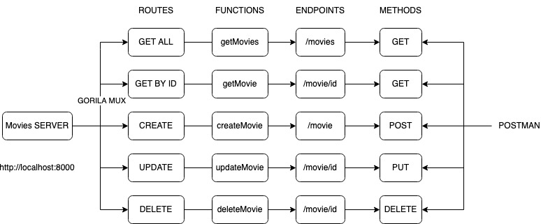

# movieCrud Gorilla/Mux Based json request 

# Gorilla/Mux JSON Formatter
# https://github.com/gorilla/mux

<h2>
    Movie Crude Service Using Postman 
</h2>



In this project we used Gorilla/mux and made 5 postman request 

<h2>Movie Crud route requests</h2>
1.  getMovies Request
2.  getMovie Request
3.  createMovie Request
4.  updateMovie Request
5.  deleteMovie Request


```go
  go build
  go run main.go
```
